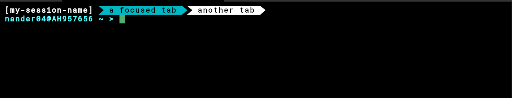

# Based Header

A plugin providing the sexiest header bar for Zellij



## Installation

1. If needed, `cargo install --locked cargo-make` to add `cargo make` command
1. `rustup target add wasm32-wasi`
1. `cargo make install`
    - This will perform a release build and install the .wasm to ~/.local/zellij-plugins/based-header.wasm next to default zellij plugins

## Usage

In a Zellij layout KDL file, point to `file:based-header.wasm`. This will use the .wasm
installed by `cargo make install`.

### Example

``` kdl
// some_layout.kdl 
layout {
    pane size=1 borderless=true {
        plugin location="file:based-header.wasm"
    }
    pane
}
```

`zellij -l ./path/to/some_layout.kdl -s my_session_name`

---

Seeded by Zellij's default plugin, `tab-bar`
